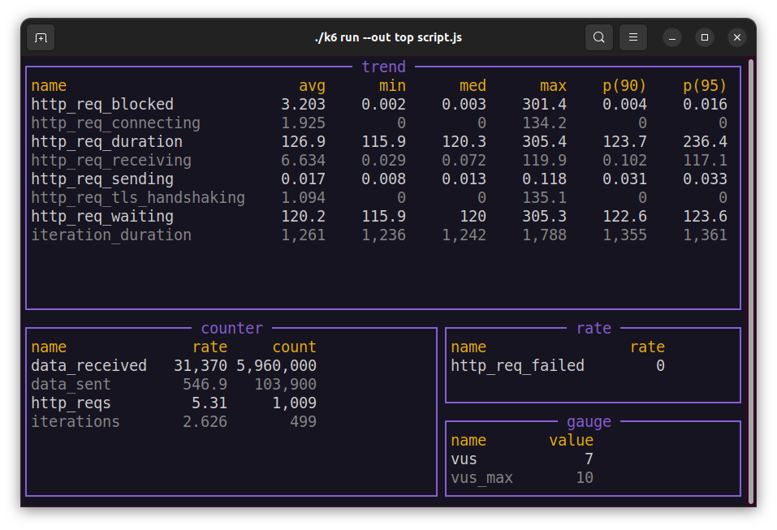

#  xk6-top <!-- omit in toc -->

A [k6 extension](https://k6.io/docs/extensions/) to updating the current [k6](https://k6.io) metrics summaries on the terminal during the test run. Metric summaries are updated on the terminal screen at regular intervals (default: 2s).

All custom [k6](https://k6.io) metrics ([Counter](https://k6.io/docs/javascript-api/k6-metrics/counter/),[Gauge](https://k6.io/docs/javascript-api/k6-metrics/gauge/),[Rate](https://k6.io/docs/javascript-api/k6-metrics/rate/),[Trend](https://k6.io/docs/javascript-api/k6-metrics/trend/)) and [build-in metrics](https://k6.io/docs/using-k6/metrics/#built-in-metrics) are supported.

**Screenshot**



**asciicast**

[](https://asciinema.org/a/NwDZk0wQTfi7lIwunHdYiDnel)

**Table of Contents**

- [Download](#download)
- [Build](#build)
- [Usage](#usage)
- [Parameters](#parameters)
- [Docker](#docker)

## Download

You can download pre-built k6 binaries from [Releases](https://github.com/szkiba/xk6-top/releases/) page. Check [Packages](https://github.com/szkiba/xk6-top/pkgs/container/xk6-top) page for pre-built k6 Docker images.

## Build

To build a `k6` binary with this extension, first ensure you have the prerequisites:

- [Go toolchain](https://go101.org/article/go-toolchain.html)
- Git

Then:

1. Download `xk6`:
  ```bash
  $ go install go.k6.io/xk6/cmd/xk6@latest
  ```

2. Build the binary:
  ```bash
  $ xk6 build --with github.com/szkiba/xk6-top@latest
  ```

## Usage

```plain
$ ./k6 run --out top script.js
```

## Parameters

The output extension accept parameters in a standard query string format:

```plain
k6 run --out 'top=param1=value1&param2=value2&param3=value3'
```

> Note apostrophe (`'`) characters around the `--out` parameter! You should use it for escape `&` characters from shell (or use backslash before `&` characters).

The following parameters are recognized:

parameter | description
----------|------------
period    | Event emitting frequency (default: `2s`), example: `1m`

## Docker

You can also use pre-built k6 image within a Docker container. To do that, you'll need to execute something more-or-less like the following:

**Linux**

```plain
docker run -v $(pwd):/scripts -it --rm ghcr.io/szkiba/xk6-top:latest run --out=top /scripts/script.js
```

**Windows**

```plain
docker run -v %cd%:/scripts -it --rm ghcr.io/szkiba/xk6-top:latest run --out=top /scripts/script.js
```

